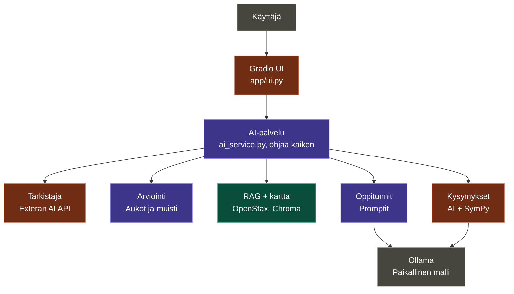

## Arkkitehtuuri ja vastuut

Värit: 🟪 Eetu, 🟩 Lauri, 🟧 Fei

---  
## Eetu: AI-palvelu ja kokonaisuus
  
1. **Runko:** koko flow pyörii feikkiosilla oikeissa tiedostoissa, jotta muut voi tehdä omat osansa odottamatta toisiaan.
2. **Arviointi:** säännöt, ei AI:ta. Aloitetaan tavoitteen läheltä ja mennään kartalla alaspäin, 2-3 kysymystä per aihe, lisäkysymys jos epäselvä, n. 15-25 kysymystä yhteensä.
3. **Aukkojen tunnistus:** jokaiselle taidolle tila osaa / ei osaa / testaamatta.
4. **Muisti:** edistyminen ja quiz-pisteet tallennetaan (JSON tai SQLite) ja jatketaan siitä seuraavalla kerralla.
5. **Eteneminen kokeiden kautta:** jokaisen oppitunnin jälkeen on koe. Taito merkitään osatuksi vasta kun koe on läpäisty (esim. 80 %), ja vasta sitten pääsee jatkamaan seuraavaan aiheeseen. Jos koe ei mene läpi, käyttäjä palaa materiaaliin ja saa uuden kokeen uusilla kysymyksillä. Aiheet käydään kartalla alhaalta ylöspäin, eli aihe avautuu vasta kun sen esitiedot on läpäisty. Kun kaikki aukot on läpäisty, tavoite on saavutettu.
6. **Oppituntien promptit:** materiaali tehdään RAG-lähteistä ja lähde näkyy käyttäjälle.
7. **Integraatio:** kaikkien osat kytketään `ai_service.py`:hin.

**Valmis kun:** käyttäjä valitsee "derivaatat", saa arvioinnin, näkee aukkonsa ja edistyminen säilyy uudelleenkäynnistyksen jälkeen.

---

## Lauri: tieto ja laatu
1. **Kirjat:** OpenStax-kirjat ladataan GitHubista ja muunnetaan Markdown + LaTeX -muotoon. Kirjat ei repoon, latausohjeet README:hen.
2. **Esitietokartta:** n. 60-80 taitoa (algebra → funktiot ja trigo → raja-arvot → derivaatat). Jokaisella id, nimi, lyhyt kuvaus ja suorat esitiedot. Vahva malli tekee draftin sisällysluetteloista. Tarkista sisällys luetteloa vasten.
3. **RAG:** kirjat pilkotaan, palat tagataan kartan taidolla, tallennus Chromaan. Sisään taito tai kysymys, ulos lähdetekstit + viite.
4. **Mallivertailu:** esim( Llama3.2, Qwen3 8B ja DeepSeek-R1), samat 5-10 matikkapromptia Kirjataan oikeellisuus, selityksen selkeys ja vastausaika taulukkoon `project-decisions.md`:hen.
5. **Evaluaatio:** `test_cases.json` täyteen (onnistuneet, vaikeat ja virhetapaukset), tulokset `evaluation_results.md`:hen.

**Valmis kun:** haku "ketjusääntö" palauttaa oikeat kappaleet ja mallivalinta on perusteltu numeroilla.

---
## Fei: kysymykset, tarkistus ja UI
1. **Kysymysgenerointi:** paikallinen malli tekee kysymykset ja vastausavaimen sovitussa formaatissa. Pydantic-validointi, yksi uusintayritys jos muoto on rikki.
2. **SymPy:** tarkistaa käyttäjän vastauksen matemaattisesti (2x+2 = 2(x+1), esim: (pilkku → piste)) ja myös sen, että AI:n oma vastausavain on oikein.
3. **Tarkistaja:** yksi Exteran AI:n API -kutsu generoinnin jälkeen, joka tarkistaa oppitunnin ja kysymykset lähteitä vasten. Jos API ei vastaa, materiaali näytetään merkinnällä "tarkistamaton". API-avain `.env`:iin, ei ikinä repoon.
4. **UI:** tavoitteen valinta, arviointikysely, aukot, oppitunti ja quiz. UI puhuu vain `ai_service.py`:lle.
5. **Testaus:** kysymysten laadun testaus omalla osalla ja promptien parantelu tarvittaessa.
  
**Valmis kun:** yhdestä aiheesta syntyy quiz, jonka vastausavain on SymPyllä tarkistettu ja external mega älyn hyväksymä.